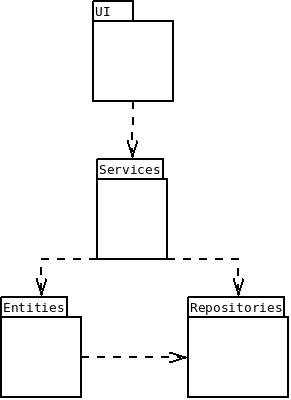

# Arkkitehtuuri

- Ohjelmassa on pyritty noudattamaan kurssilla esiteltyä mallia.

## Repositories:

- Luokka Questions vastaa kysymyspakettien luomisesta.

## Entities:

- Luokka Game toimii peli objektina ja säilyttää ajankohtaisen pelitilanteen.
- Luokka Highscores on malli tallennettavalle huipputulokselle.

## Services:

- Connection_services vastaa tietokantaan yhdistämisestä
- game_services sisältää itse pelin toiminnan mahdollistavat funktiot. Se hankkii kysymykset ja looppaa pelin läpi. Hoitaa vastausten
tarkistamisen.
- highscore_services hoitaa yhteyden highscore.cvs tiedoston kanssa ja tallentaa sekä näyttää huipputulokset.
- question_services hankkii raakaa dataa tietokannasta luokalle questions.
- ui_services tarjoaa käyttöliittymälle indeksintarkistuksen.

## Käyttöliittymä

- Käyttöliittymä on toteutettu yhdellä ikkunalla, samaa näkymää päivittäen.

## Kysymystietokanta ja tulokset

- Kysymysten aineisto säilytetään data.db tietokannassa.
- Tietokannassa on kaksi taulua. Countires ja cities.
- Countries taulussa on kentät name, cca2, capital.
- Cities taulussa on kentät cca2 ja name.

- Tulokset tallennetaan Higscores.cvs tiedostoon muodossa: juha,10,2022-12-25
- Ensimmäinen kenttä on käyttäjän nimi, toinen pisteet ja kolmas päivämäärä.

## Pelin sekvenssikaavio
- Yksinkertainen kuvaus pelin toiminnasta.

```mermaid
sequenceDiagram
actor user
user -> game_services: start_game()
game_services -> Game: Game()
game_Services -> game_services: play_game(game)
game_Services -> Questions: init_questions()

loop while game.running == True
    game_services -> Questions: get_questions()
    alt if check_correct(answer, correct)
        game_services -> Game: increase_score()
    end
    game_services -> Game: game.rounds +=1
end
Game -> game_services: score

game_Services -> highscore_services: check_score(score)
alt check_score(result)
    game_services -> Highscore: Highscore(name, score, date)
    Highscore -> higscore_Services: save_to_file(self)
end 
```

